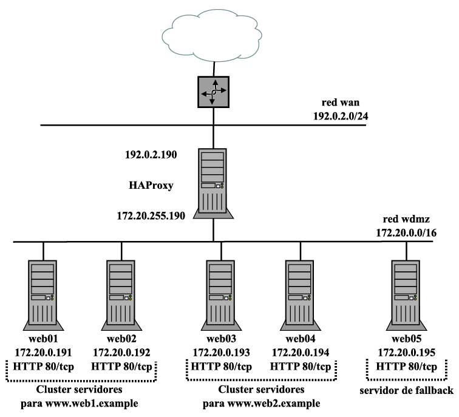

# ⚖️ HAProxy Load Balancer Lab

## 📌 Descripción

Este laboratorio implementa una arquitectura de **balanceo de carga con HAProxy**, demostrando el reparto de tráfico entre servidores backend, la detección automática de caídas y la recuperación de servicios.

El laboratorio está enfocado a validar, mediante **logs en tiempo real y pruebas prácticas**, el correcto funcionamiento de :

- Balanceo de cargas.

- Alta disponibilidad.

- Tolerancia a fallos

- Health checks

- Arquitectura resiliente

Todo el comportamiento del sistema se valida mediante **evidencias reales en video**, tal y como se haría en un entorno profesional.

---

## 🎯 Objetivos del laboratorio

- Configurar HAProxy como balanceador de carga

- Implementar servidores backend

- Validar el reparto de tráfico entre nodos

- Comprobar balanceo Round Robin

- Monitorizar logs en tiempo real

- Detectar caídas de servicios

- Verificar redistribución automática del tráfico

- Validar recuperación de nodos

- Garantizar continuidad de servicio

---

## 🏗️ Arquitectura



---

## 🧱 Componentes

- 🧭 HAProxy (Load Balancer)

- 🖥️ Web01 (Servidor web backend)

- 🖥️ Web02 (Servidor web backend)

- 💻 Cliente (host o contenedor)

- 🌐 Red interna

---

## 📂 Contenido del laboratorio

Este repositorio incluye:

- 📄 Fichero de configuración de HAProxy ([ver aquí](./haproxy.cfg))

- 📊 Estadísticas de HAProxy ([ver aquí](./Material/Images/Estadisticas_HAProxy.png))

- 🎥 Vídeos de demostración ([ver aquí](./Material/video/))

---

## 🎥 Evidencias en vídeo

### 📹 Vídeo 1 — Balanceo de carga

Pantalla dividida mostrando:

- 🪵 Log de HAProxy en tiempo real

- 💻 Terminal del cliente ejecutando:

```
curl http://www.ID1.example   (4 veces seguidas)
curl http://www.ID2.example   (5 veces seguidas)
```

**🎯 Objetivo:**
Visualizar claramente el reparto de peticiones entre los servidores backend y el comportamiento del balanceador.

⛓️‍💥 Puedes acceder a él accediendo [aqui](./Material/video/Video1.mp4)

### 📹 Vídeo 2 — Tolerancia a fallos y recuperación

Pantalla dividida mostrando:

- 🪵 Log de HAProxy en tiempo real

- 💻 Terminal del cliente solicitando páginas web

Secuencia de acciones:

```

- curl http://www.ID1.example   (2 veces)
- Parada del servidor web01
- Espera a detección de caída en logs
- curl http://www.ID1.example   (2 veces)
- Arranque de web01
- Espera a detección de recuperación en logs
- curl http://www.ID1.example   (2 veces)
```

**🎯 Objetivo:**

Demostrar:

- Detección automática de caída

- Redistribución de tráfico

- Continuidad de servicio

- Recuperación automática del nodo

- Alta disponibilidad real

⛓️‍💥 Puedes acceder a él accediendo [aqui](./Material/video/Video2.mp4)

---

## 👤 Autor

Manuel Míguez Liméns

[GitHub](https://github.com/manuelmiguezlimens) | [LinkedIn](https://www.linkedin.com/in/manuelmiguezlimens/) | [Gmail](mailto:miguezlimensmanuel@gmail.com)